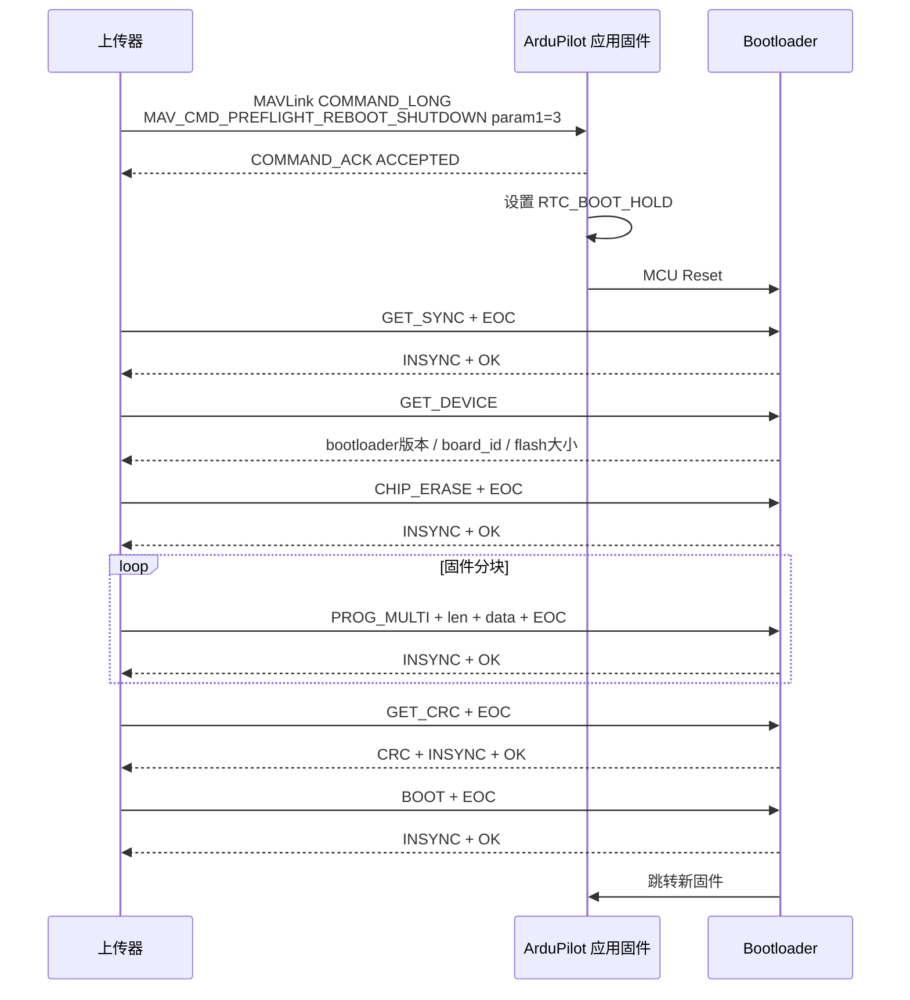

# ArduPilot 串口固件升级流程

本文说明 ArduPilot 通过串口升级主控固件的实现方式、涉及的 MAVLink 指令，以及进入 bootloader 后使用的串口刷写协议。

相关代码：

- `Tools/scripts/uploader.py`
- `Tools/AP_Bootloader/AP_Bootloader.cpp`
- `Tools/AP_Bootloader/bl_protocol.cpp`
- `libraries/GCS_MAVLink/GCS_Common.cpp`
- `libraries/AP_Vehicle/AP_Vehicle.cpp`
- `libraries/AP_HAL_ChibiOS/Scheduler.cpp`

## 总体结论

ArduPilot 串口升级不是全程 MAVLink。

流程分为两段：

1. 飞控正常运行时，通过 MAVLink 命令让飞控重启并停留在 bootloader。
2. 进入 bootloader 后，通过 ArduPilot/PX4 bootloader 串口协议擦除、写入、校验 Flash。

MAVLink 只负责触发重启进 bootloader，固件数据传输不是 MAVLink。

## MAVLink 阶段

串口升级使用的主要 MAVLink 命令是：

```text
COMMAND_LONG
MAV_CMD_PREFLIGHT_REBOOT_SHUTDOWN
```

关键参数：

```text
param1 = 1：普通重启
param1 = 3：重启并停留在 bootloader
```

`Tools/scripts/uploader.py` 中会构造该命令：

```python
mavutil.mavlink.MAV_CMD_PREFLIGHT_REBOOT_SHUTDOWN
param1 = 3
```

ArduPilot 处理入口在 `GCS_MAVLINK::handle_preflight_reboot()`，位置为 `libraries/GCS_MAVLink/GCS_Common.cpp`。

核心逻辑：

```cpp
if (!(is_equal(packet.param1, 1.0f) || is_equal(packet.param1, 3.0f))) {
    return MAV_RESULT_UNSUPPORTED;
}

const bool hold_in_bootloader = is_equal(packet.param1, 3.0f);
AP::vehicle()->reboot(hold_in_bootloader);
```

如果飞控已经解锁，默认拒绝重启，除非带强制 magic：

```cpp
const uint32_t magic_force_reboot_value = 20190226;
```

## 重启进入 bootloader

车辆层重启入口为 `AP_Vehicle::reboot(bool hold_in_bootloader)`，位置为 `libraries/AP_Vehicle/AP_Vehicle.cpp`。

重启前会执行：

- 关闭或归零输出
- 强制 safety
- flush 参数
- 停止日志
- 等待 ACK 发出
- 调用底层 scheduler reboot

ChibiOS 平台最终进入 `Scheduler::reboot(bool hold_in_bootloader)`，位置为 `libraries/AP_HAL_ChibiOS/Scheduler.cpp`。

关键逻辑：

```cpp
set_fast_reboot(hold_in_bootloader ? RTC_BOOT_HOLD : RTC_BOOT_FAST);
NVIC_SystemReset();
```

当 `hold_in_bootloader = true` 时，会写入：

```text
RTC_BOOT_HOLD
```

MCU 复位后，bootloader 检测到该标志，就不会跳转到应用固件，而是停留在 bootloader 等待刷机。

## Bootloader 阶段

进入 bootloader 后，通信不再是 MAVLink，而是 ArduPilot/PX4 bootloader 串口协议。

协议定义位置：

```text
Tools/AP_Bootloader/bl_protocol.cpp
```

命令格式：

```text
<opcode>[command_data]<EOC>
```

响应格式：

```text
[reply_data]<INSYNC><status>
```

关键字节：

```text
INSYNC = 0x12
EOC    = 0x20
OK     = 0x10
FAILED = 0x11
INVALID = 0x13
```

## Bootloader 协议命令

常用命令如下：

| 命令 | 值 | 作用 |
|---|---:|---|
| `GET_SYNC` | `0x21` | 同步，确认 bootloader 在线 |
| `GET_DEVICE` | `0x22` | 获取 bootloader 版本、板卡 ID、Flash 大小 |
| `CHIP_ERASE` | `0x23` | 擦除应用固件区域 |
| `PROG_MULTI` | `0x27` | 分块写入内部 Flash |
| `READ_MULTI` | `0x28` | 读回 Flash，旧协议校验使用 |
| `GET_CRC` | `0x29` | 计算内部 Flash CRC |
| `GET_OTP` | `0x2a` | 读取 OTP |
| `GET_SN` | `0x2b` | 读取芯片序列号 |
| `GET_CHIP` | `0x2c` | 读取 MCU ID |
| `GET_CHIP_DES` | `0x2e` | 读取芯片描述 |
| `BOOT` | `0x30` | 结束刷写并启动应用固件 |
| `SET_BAUD` | `0x33` | 切换 bootloader 串口波特率 |
| `EXTF_ERASE` | `0x34` | 擦除外部 Flash |
| `EXTF_PROG_MULTI` | `0x35` | 写外部 Flash |
| `EXTF_GET_CRC` | `0x37` | 校验外部 Flash |
| `CHIP_FULL_ERASE` | `0x40` | 强制完整擦除 |

## 串口升级流程

### 1. 打开串口

上传工具打开串口，常见实现位于 `Tools/scripts/uploader.py`。

如果飞控还在运行应用固件，上传器会发送 MAVLink 重启命令：

```text
MAV_CMD_PREFLIGHT_REBOOT_SHUTDOWN
param1 = 3
```

### 2. 等待 bootloader

上传器不断发送：

```text
GET_SYNC + EOC
```

字节为：

```text
0x21 0x20
```

bootloader 正常响应：

```text
INSYNC + OK
```

字节为：

```text
0x12 0x10
```

### 3. 获取设备信息

上传器发送：

```text
GET_DEVICE + 参数 + EOC
```

常用参数：

```text
1：bootloader 协议版本
2：board id
3：board revision
4：可刷写 Flash 大小
6：外部 Flash 大小
```

上传器会用这些信息和固件 `.apj` 中的 `board_id` 比较，避免刷错板卡。

### 4. 可选切换波特率

如果配置了更高的刷写波特率，上传器发送：

```text
SET_BAUD
```

bootloader 回复成功后，上传器也切换本地串口波特率。

### 5. 擦除 Flash

上传器发送：

```text
CHIP_ERASE + EOC
```

bootloader 处理：

```cpp
case PROTO_CHIP_ERASE:
```

bootloader 会擦除应用固件区域，并验证擦除结果是否为 `0xffffffff`。

### 6. 分块写入固件

上传器将固件镜像切成多个块，逐块发送：

```text
PROG_MULTI + len + data + EOC
```

bootloader 处理：

```cpp
case PROTO_PROG_MULTI:
```

内部流程：

1. 检查是否已经完成 `GET_SYNC`。
2. 检查是否已经读取必要的设备信息。
3. 检查写入长度是否 4 字节对齐。
4. 检查写入地址是否超出固件区域。
5. 写入 Flash。
6. 当前写入地址自增。

bootloader 会暂存应用固件最前面的若干 word，直到最后 `BOOT` 命令时才真正写入。这样可以避免升级中断后误启动一个不完整固件。

### 7. 校验固件

新版 bootloader 使用：

```text
GET_CRC + EOC
```

bootloader 返回：

```text
<crc:4> + INSYNC + OK
```

上传器本地也计算固件 CRC，两者必须一致。

旧协议可能使用：

```text
READ_MULTI
```

逐块读回校验。

### 8. 启动新固件

上传器发送：

```text
BOOT + EOC
```

字节为：

```text
0x30 0x20
```

bootloader 处理：

```cpp
case PROTO_BOOT:
```

bootloader 会：

1. flush Flash 写入。
2. 写入之前暂存的固件头部 first words。
3. 回复 `INSYNC + OK`。
4. 返回 bootloader 主循环。
5. 跳转到应用固件入口。

## 简化时序



## 总结

ArduPilot 串口升级流程可以概括为：

```text
MAVLink 触发重启进 bootloader
→ bootloader 串口同步
→ 读取板卡信息
→ 校验固件 board_id
→ 擦除 Flash
→ 分块写入固件
→ CRC 校验
→ BOOT 启动新固件
```

其中 MAVLink 只使用：

```text
MAV_CMD_PREFLIGHT_REBOOT_SHUTDOWN
param1 = 3
```

真正的固件传输和刷写使用的是 bootloader 串口协议，不是 MAVLink FTP。