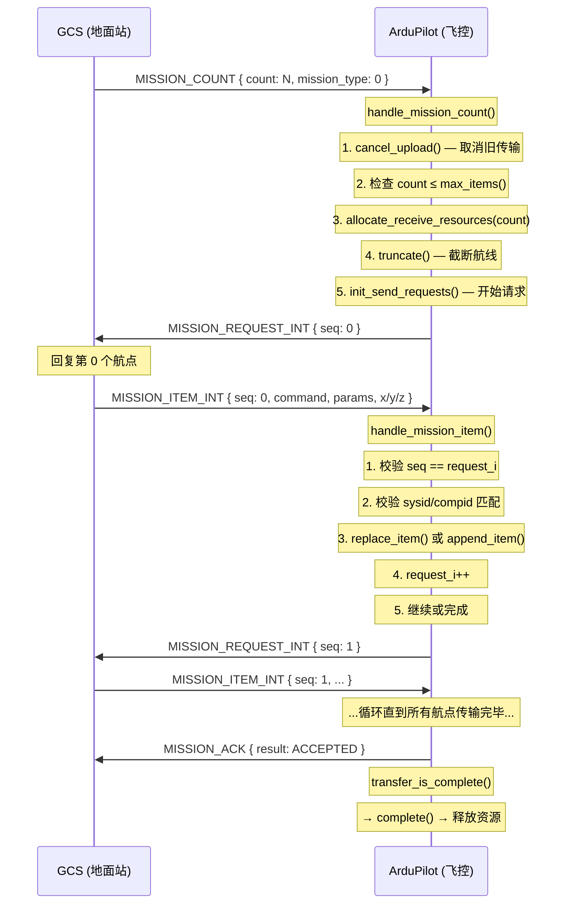
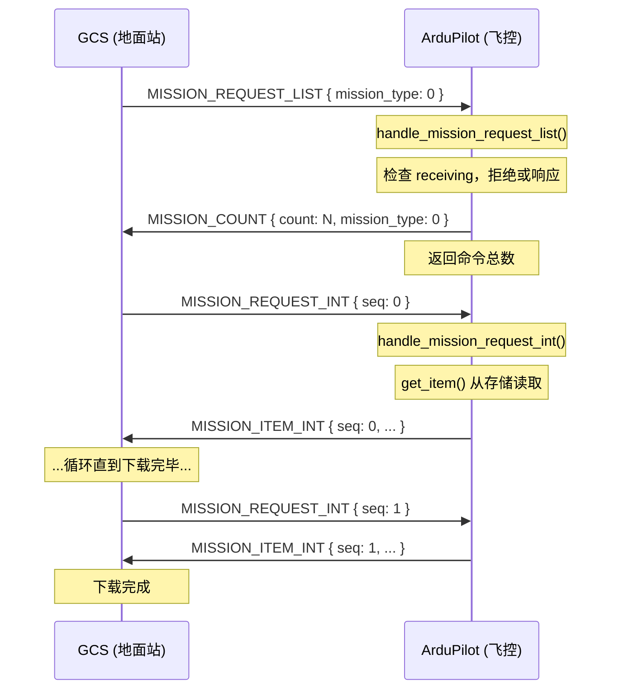

# ArduPilot 航线/航点任务 (Mission/Waypoint) 协议交互流程

## 概述

ArduPilot 的航线任务通过 **MAVLink 协议** 与地面站 (GCS) 交互。核心代码分布在以下文件中：

| 文件 | 职责 |
|------|------|
| `libraries/GCS_MAVLink/MissionItemProtocol.h/.cpp` | 通用协议处理基类 |
| `libraries/GCS_MAVLink/MissionItemProtocol_Waypoints.h/.cpp` | 航点协议实现 |
| `libraries/AP_Mission/AP_Mission.h/.cpp` | 航线存储与执行引擎 |
| `ArduCopter/mode_auto.cpp` 等 | 飞行器端的指令执行/验证 |

---

## 一、上传航线（GCS → 飞控）

### 1.1 完整时序图



### 1.2 阶段 1：GCS 发起上传

GCS 发送 **`MISSION_COUNT`** 消息：

| 字段 | 值 | 说明 |
|------|-----|------|
| `count` | N | 航点总数（含 HOME） |
| `mission_type` | 0 | `MAV_MISSION_TYPE_MISSION` |

飞控端 **`handle_mission_count()`** 处理流程：

```
handle_mission_count()
├── mavlink2_requirement_met() — 检查 MAVLink2 支持
├── cancel_upload()
│   ├── 如果已有传输:
│   │   ├── 同一 GCS → 取消旧传输，允许重新开始
│   │   └── 不同 GCS → 拒绝 (MAV_MISSION_DENIED)
│   └── 无传输 → 直接继续
├── count ≤ max_items()? 否则返回 MAV_MISSION_NO_SPACE
├── allocate_receive_resources(count) — 分配接收资源
├── truncate(packet) — 截断当前航线到目标长度
├── if count == 0 → 直接完成 (transfer_is_complete)
└── init_send_requests() — 开始逐条请求
    ├── receiving = true (锁定互斥)
    ├── dest_sysid / dest_compid = 发送方标识
    ├── request_i = 0, request_last = count - 1
    └── 立即发送第一个 MISSION_REQUEST_INT
```

### 1.3 阶段 2：逐条请求和接收航点

飞控发送 **`MISSION_REQUEST_INT`**（推荐）或 **`MISSION_REQUEST`**（旧版）：

| 字段 | 说明 |
|------|------|
| `target_system` | 目标系统 ID |
| `target_component` | 目标组件 ID |
| `seq` | 请求的航点序号 |
| `mission_type` | 任务类型 |

GCS 回复 **`MISSION_ITEM_INT`**（推荐）或 **`MISSION_ITEM`**（旧版）：

| 字段 | 说明 |
|------|------|
| `seq` | 航点序号 |
| `frame` | 坐标系 (RELATIVE_ALT / ABSOLUTE / TERRAIN) |
| `command` | MAVLink 命令 ID |
| `current` | 0: 非当前, 1: 当前 |
| `autocontinue` | 自动继续标志 |
| `param1~4` | 命令参数 |
| `x / y / z` | 经度 / 纬度 / 高度 |

飞控端 **`handle_mission_item()`** 处理流程：

```
handle_mission_item(msg, cmd)
├── 检查 link != nullptr
├── cmd.seq == request_i? 否则 MAV_MISSION_INVALID_SEQUENCE
├── msg.sysid == dest_sysid? 否则 MAV_MISSION_DENIED
├── msg.compid == dest_compid? 否则 MAV_MISSION_DENIED
├── 确定操作类型:
│   ├── cmd.seq < item_count() → replace_item(cmd) 替换
│   ├── cmd.seq == item_count() → append_item(cmd) 追加
│   └── cmd.seq > item_count() → MAV_MISSION_ERROR
├── 操作失败? → send_mission_ack() + 释放资源
├── 更新 timelast_receive_ms
├── request_i++
├── request_i > request_last?
│   ├── 是 → transfer_is_complete()
│   └── 否 → 发送下一个 MISSION_REQUEST_INT
```

**`append_item()` 内部流程：**

```
append_item(mission_item_int)
├── mavlink_int_to_mission_cmd() — 将 MAVLink 格式转为内部格式
│   ├── 根据 command 类型解析参数
│   ├── 将 param1~4 和 x/y/z 存入 Mission_Command
│   └── 校验参数合法性 (NaN/Inf)
├── 如果是 DO_JUMP → 检查跳转目标是否有效
└── mission.add_cmd(cmd) — 写入存储
```

### 1.4 阶段 3：传输完成

**`transfer_is_complete()`：**

```
transfer_is_complete(link, msg)
├── complete(link) — 回调子类
│   └── MissionItemProtocol_Waypoints:
│       ├── 发消息 "Flight plan received"
│       └── AP::logger().Write_EntireMission() 记录日志
├── send_mission_ack(link, msg, MAV_MISSION_ACCEPTED)
├── free_upload_resources() — 释放资源
├── receiving = false
└── link = nullptr
```

### 1.5 超时与错误恢复

| 机制 | 说明 |
|------|------|
| **上传超时** | 8 秒 (`upload_timeout_ms = 8000`)，无新航点到达则取消 |
| **请求重发** | 发出请求后 1 秒+链路延迟未收到响应，自动重发 |
| **并发互斥** | `receiving = true` 期间禁止下载和其他上传 |

---

## 二、下载航线（飞控 → GCS）



**`get_item()` 内部流程：**

```
get_item(link, msg, packet, ret_packet)
├── seq == 0? (HOME) → 始终允许读取
├── seq ≥ mission.num_commands()? → 发送修正的 MISSION_COUNT
├── mission.read_cmd_from_storage(packet.seq, cmd) — 从存储读取
├── mission_cmd_to_mavlink_int(cmd, ret_packet) — 转回 MAVLink 格式
├── 如果 cmd.id 是当前导航命令 → current = 1
├── 否则 → current = 0
└── autocontinue = 1
```

---

## 三、航线执行引擎 (AP_Mission)

### 3.1 状态机

```
AP_Mission::update()  [每 10Hz 调用]
│
├── state != MISSION_RUNNING? → 退出
│
├── nav_cmd_loaded == false?
│   └── advance_current_nav_cmd()
│       ├── 从当前搜索位置开始
│       ├── 跳过 DO 命令、处理 DO_JUMP
│       ├── 找到导航命令 → start_command(_nav_cmd)
│       │   └── 回调 _cmd_start_fn() (Copter→start_command)
│       ├── 同时加载其间的 DO 命令
│       └── 未找到? → complete() (MISSION_COMPLETE)
│
├── nav_cmd_loaded == true?
│   └── verify_command(_nav_cmd)
│       ├── 完成? → nav_cmd_loaded = false
│       │   └── advance_current_nav_cmd() 推进到下一条
│       └── 未完成? → 继续执行
│
├── do_cmd_loaded == false?
│   └── advance_current_do_cmd()
│       └── 搜索下一个 DO 命令
│
└── do_cmd_loaded == true?
    └── verify_command(_do_cmd)
        └── 完成? → do_cmd_loaded = false
```

### 3.2 命令生命周期

每条导航命令经历三个阶段：

```
1. 启动 (start) ──→ 2. 运行 (verify) ──→ 3. 完成 → 下一条
```

- **启动**: `start_command()` / `_cmd_start_fn()` — 设置目标位置、飞行模式等
- **验证**: `verify_command()` / `_cmd_verify_fn()` — 检查是否完成（到达、超时等）
- **完成**: 自动推进到下一条命令

DO 命令（如 `DO_SET_SERVO`、`DO_SET_RELAY` 等）在基类 `verify_command()` 中直接返回 `true`，即执行完立即完成，无需等待。

### 3.3 DO_JUMP 跳转机制

```
DO_JUMP { target: N, num_times: M }
├── 记录已执行次数 (jump_tracking[])
├── num_times == -1 (AP_MISSION_JUMP_REPEAT_FOREVER)?
│   └── 无限重复跳转
├── 已执行次数 < num_times?
│   ├── 递增次数
│   └── 跳转到 target 位置
└── 已执行次数 ≥ num_times?
    └── 继续下一条命令
```

**JUMP_TAG 机制（MAV_CMD 600/601）：**

```
DO_JUMP_TAG { tag: T }  →  转换为 DO_JUMP { target: index_of_tag(T) }
JUMP_TAG { tag: T }                   →  跳转目标标记点
```

使用标签跳转比按序号跳转更灵活——插入新航点不会破坏跳转目标。

---

## 四、Copter 命令分发

在 `ArduCopter/mode_auto.cpp` 中，`start_command()` 进行命令分发：

| MAV_CMD | ID | 处理函数 | 说明 |
|---------|----|---------|------|
| `NAV_WAYPOINT` | 16 | `do_nav_wp()` | 导航到航点 |
| `NAV_TAKEOFF` | 22 | `do_takeoff()` | 起飞 |
| `NAV_LAND` | 21 | `do_land()` | 降落 |
| `NAV_LOITER_UNLIM` | 17 | `do_loiter_unlimited()` | 无限悬停 |
| `NAV_LOITER_TURNS` | 18 | `do_circle()` | 绕圈 N 次 |
| `NAV_LOITER_TIME` | 19 | `do_loiter_time()` | 悬停指定时间 |
| `NAV_LOITER_TO_ALT` | 31 | `do_loiter_to_alt()` | 悬停到指定高度 |
| `NAV_RTL` | 20 | `do_RTL()` | 返航 |
| `NAV_SPLINE_WAYPOINT` | 82 | `do_spline_wp()` | 样条曲线航点 |
| `NAV_GUIDED_ENABLE` | 92 | `do_nav_guided_enable()` | 启用外部导航 |
| `NAV_DELAY` | 93 | `do_nav_delay()` | 延迟 |
| `NAV_ATTITUDE_TIME` | 221 | `do_nav_attitude_time()` | 按姿态飞行指定时间 |
| `CONDITION_DELAY` | 112 | `do_wait_delay()` | 条件延时 |
| `CONDITION_DISTANCE` | 114 | `do_within_distance()` | 条件距离 |
| `CONDITION_YAW` | 115 | `do_yaw()` | 偏航控制 |
| `DO_CHANGE_SPEED` | 178 | `do_change_speed()` | 改变速度 |
| `DO_SET_HOME` | 179 | `do_set_home()` | 设置 HOME |
| `DO_SET_ROI*` | 195/197/201 | `do_roi()` | 兴趣点 |
| `DO_JUMP` | 177 | (AP_Mission 引擎处理) | 跳转 |
| `DO_RETURN_PATH_START` | 188 | (空) | 返航路径起点 |
| `DO_LAND_START` | 189 | (空) | 降落路径起点 |

---

## 五、关键数据结构

### 5.1 `AP_Mission` 状态标志

```
_flags.state:        MISSION_RUNNING / MISSION_STOPPED / MISSION_COMPLETE
_flags.nav_cmd_loaded:  当前是否有活动的导航命令
_flags.do_cmd_loaded:   当前是否有活动的 DO 命令
_flags.do_cmd_all_done: 所有 DO 命令已完成
_flags.in_landing_sequence: 是否在降落序列中
_flags.in_return_path:      是否在返航路径中
_flags.resuming_mission:    是否正在恢复任务
```

### 5.2 当前命令

```cpp
_nav_cmd:  Mission_Command   // 当前导航命令
_do_cmd:   Mission_Command   // 当前 DO 命令
```

### 5.3 跳转跟踪

```cpp
_jump_tracking[]: {
    index: uint16_t,         // 跳转命令序号
    num_times_run: uint16_t  // 已执行次数
}
// 最大记录 AP_MISSION_MAX_NUM_DO_JUMP_COMMANDS 条
```

### 5.4 `Mission_Command` 内部结构

```
Mission_Command {
    index: uint16_t                     // 命令序号
    id: uint16_t                        // MAVLink 命令 ID
    p1: uint16_t                        // 参数1 (16位压缩存储)
    content: union {                    // 12 字节参数内容
        Location location;              // 位置相关命令 (lat/lng/alt/flags)
        delay.seconds;                  // CONDITION_DELAY
        distance.meters;                // CONDITION_DISTANCE
        jump.target / jump.num_times;   // DO_JUMP
        speed.speed_type / .target_ms;  // DO_CHANGE_SPEED
        servo.channel / .pwm;           // DO_SET_SERVO
        relay.num / .state;             // DO_SET_RELAY
        yaw.angle_deg / .direction;     // CONDITION_YAW
        // ... 更多命令类型
    }
    type_specific_bits: uint8_t         // 类型特定位标志
}
```

### 5.5 EEPROM 存储格式

```
Offset 0-3:     EEPROM 版本号 (uint32_t)
Offset 4+:      命令数组，每条 15 字节

命令存储 (15 字节):
  Byte 0:       命令 ID (<256 直接存储，否则用 tag byte)
  Byte 1-2:     p1 (uint16_t)
  Byte 3-14:    PackedContent (12 字节)

注: 命令 #0 预留为 HOME 位置（从 AHRS 读取）
```

---

## 六、MISSION_ACK 结果码

| 结果码 | 值 | 含义 |
|--------|-----|------|
| `MAV_MISSION_ACCEPTED` | 0 | 成功 |
| `MAV_MISSION_ERROR` | 1 | 一般错误 |
| `MAV_MISSION_DENIED` | 2 | 拒绝（已有传输在进行） |
| `MAV_MISSION_NO_SPACE` | 3 | 存储空间不足 |
| `MAV_MISSION_INVALID` | 4 | 无效命令 ID |
| `MAV_MISSION_INVALID_SEQUENCE` | 5 | 序号不匹配 |
| `MAV_MISSION_UNSUPPORTED` | 6 | 不支持（如需要 MAVLink2） |
| `MAV_MISSION_INVALID_PARAM1` | 7 | 参数1无效 (NaN/Inf) |
| `MAV_MISSION_INVALID_PARAM2` | 8 | 参数2无效 |
| `MAV_MISSION_INVALID_PARAM3` | 9 | 参数3无效 |
| `MAV_MISSION_INVALID_PARAM4` | 10 | 参数4无效 |
| `MAV_MISSION_OPERATION_CANCELLED` | 11 | 操作取消（超时） |

---

## 七、MISSION_WRITE_PARTIAL_LIST（部分更新）

允许 GCS 更新航线中的部分航点，而不需要重新上传整个航线：

```
GCS → FC: MISSION_WRITE_PARTIAL_LIST { start_index, end_index }
FC:
├── 检查 receiving（上传中则拒绝）
├── 检查索引范围合法
├── allocate_update_resources()
└── init_send_requests() — 逐个请求需要更新的航点
```

---

## 八、MirrorMission（航线镜像同步）

ArduPilot 支持通过 **`MISSION_ITEM_REACHED`** 和 **`MISSION_CURRENT`** 消息实时同步航线执行状态：

| 消息 | 触发时机 | 说明 |
|------|---------|------|
| `MISSION_CURRENT` | 每个新导航命令启动时 | 包含当前命令序号 |
| `MISSION_ITEM_REACHED` | 到达航点时 | 包含到达的航点序号 |

用于 GCS 上实时显示航点执行进度和镜像航线状态。

---

## 九、最佳实践与注意事项

1. **始终使用 `MISSION_REQUEST_INT` / `MISSION_ITEM_INT`**（MAVLink2），而非旧版 `MISSION_REQUEST` / `MISSION_ITEM`。ArduPilot 在收到旧版协议时会发出警告（`"got MISSION_REQUEST; use MISSION_REQUEST_INT!"`）。

2. **`MISSION_REQUEST_LIST`**（MAVLink2 协议）允许 GCS 一次性请求获取航线总数，比先下载再请求更高效。

3. **`JUMP_TAG` / `DO_JUMP_TAG`**（MAV_CMD 600/601）比传统 `DO_JUMP` 更灵活——按标签跳转不受插入/删除航点影响。

4. **航线命令 #0 预留为 HOME**，第一条有效命令从 #1 开始。

5. **上传超时 8 秒**（`upload_timeout_ms = 8000`），在信号不稳定的环境中需确保 GCS 在此时间内回复。

6. **参数校验**：`NaN` 和 `Inf` 值会被拒绝（`MAV_MISSION_INVALID_PARAM*`），部分命令允许特定参数为 NaN（如 `NAV_WAYPOINT` 的 param4）。

---

## 十、最大航点数量

### 10.1 计算方式

在 `AP_Mission::init()` 中：

```cpp
_commands_max = (_storage.size() - 4) / AP_MISSION_EEPROM_COMMAND_SIZE;
```

- `_storage.size()`：Mission 存储区总字节数
- `- 4`：前 4 字节为 EEPROM 版本号
- `AP_MISSION_EEPROM_COMMAND_SIZE = 15`：每条命令固定 15 字节

### 10.2 不同硬件的最大航点数量

| 飞控硬件 | HAL_STORAGE_SIZE | STORAGE_NUM_AREAS | Mission 存储区 | 最大命令数 |
|---------|-----------------|-------------------|--------------|-----------|
| 小型板 (PX4v1 等) | 4096 | 4 | 2506 字节 | 166 |
| 中档板 (Pixhawk 等) | 8192 | 10 | 2132 字节 | 142 |
| 大型板 (15k) | 15360 | 15 | 5204 字节 | 347 |
| **FC-A6H7** (STM32H7) | **32768** | **18** | **9842 字节** | **655** |
| 带 SD 卡扩展 | 32768 + BRD_SD_MISSION | 18 | 9842 + SD 扩展 | 655 + SD 扩展 |

### 10.3 FC-A6H7 详细拆解

**存储布局**（`StorageManager.cpp`，`STORAGE_NUM_AREAS = 18`）：

```c
{ StorageParam,    16384, 1280 },
{ StorageMission,  17664, 9842 },   // ← Mission 区
{ StorageParamBak, 27506, 5262 },
```

**计算**：

```
_commands_max = (9842 - 4) / 15 = 9838 / 15 = 655.86 → 655
```

### 10.4 注意事项

- 命令 **#0** 预留为 **HOME**，有效用户航点序号为 **1 ~ 654**
- `MISSION_COUNT.count` 包含 HOME，即上传时 `count ≤ 655`
- 命令 ID < 256 和 ≥ 256 均占 15 字节，不影响最大数量
- **SD 卡扩展**：`BRD_SD_MISSION` 参数可附加 SD 卡空间，大幅增加航点容量（需 `AP_SDCARD_STORAGE_ENABLED` 支持）

### 10.5 相关参数

| 参数 | 位置 | 说明 |
|------|------|------|
| `MIS_TOTAL` | `AP_Mission._cmd_total` | 当前航线命令总数（只读） |
| `MIS_RESTART` | `AP_Mission._restart` | 进入 Auto 时是否重新开始 |
| `MIS_OPTIONS` | `AP_Mission._options` | 航线选项（如启动时清除） |
| `BRD_SD_MISSION` | `AP_BoardConfig.sdcard_storage.mission_kb` | SD 卡 Mission 扩展大小(KB) |
